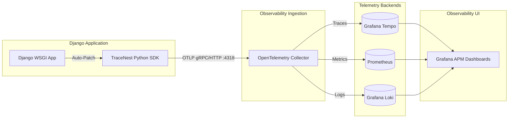

# TraceNest APM — Fundamentals & Core Architecture Guide

> **The Definitive Primer** to understanding TraceNest: what it is, how it works, OpenTelemetry request waterfalls, metric generation, visual span hierarchy, and the Grafana APM dashboard ecosystem.

---

## Table of Contents
1. [What is TraceNest?](#1-what-is-tracenest)
2. [The Core Telemetry Pipeline](#2-the-core-telemetry-pipeline)
3. [Auto-Instrumentation: How Zero-Code Tracing Works](#3-auto-instrumentation-how-zero-code-tracing-works)
4. [Anatomy of a TraceNest Request Waterfall](#4-anatomy-of-a-tracenest-request-waterfall)
5. [The Metric Generation Engine (RED Metrics)](#5-the-metric-generation-engine-red-metrics)
6. [Visual Span Hierarchy & Icon System](#6-visual-span-hierarchy--icon-system)
7. [The TraceNest Dashboard Suite](#7-the-tracenest-dashboard-suite)
8. [Quickstart: Integrating TraceNest into Django](#8-quickstart-integrating-tracenest-into-django)
9. [Architecture Comparison: TraceNest vs Datadog](#9-architecture-comparison-tracenest-vs-datadog)

---

## 1. What is TraceNest?

**TraceNest** is an OpenTelemetry-native Application Performance Monitoring (APM) SDK and observability stack designed as an open-source, vendor-neutral alternative to commercial APMs like Datadog and New Relic.

### Core Value Proposition
- 🚀 **Zero Code Changes**: Auto-instruments Django, PostgreSQL, Redis, external HTTP requests, and S3 calls with a single `tracenest.init()` call.
- 🌲 **Full Request Waterfalls**: Generates end-to-end distributed traces showing exact middleware, view, template, SQL query, and cache timing.
- 📊 **Real-time RED Metrics**: Auto-derives Rate, Error, and Duration histograms without manual metric instrumentation.
- ⚡ **Zero Vendor Lock-In**: Built 100% on open standards (**OpenTelemetry OTLP**, **Grafana Tempo**, **Prometheus**, and **Grafana**).

---

## 2. The Core Telemetry Pipeline



### 1. Ingestion (`src/tracenest`)
When a request enters the application, the TraceNest SDK creates a root trace context and attaches spans for every internal operation (middleware, views, database queries, cache lookups).

### 2. Export (OTLP Standard)
Spans and metrics are batched in memory and exported asynchronously over standard OTLP HTTP/gRPC (`/v1/traces`, `/v1/metrics`) to the OpenTelemetry Collector on port `4318`.

### 3. Processing & Routing
The OpenTelemetry Collector receives the telemetry, enriches it with environment attributes, and fans it out:
- **Traces** $\rightarrow$ Grafana Tempo (storage and waterfall queries).
- **Metrics** $\rightarrow$ Prometheus (time-series storage for aggregation and PromQL).

### 4. Visualization & Correlation
Grafana queries Prometheus for high-level aggregated service metrics (P95 latency, throughput, error rates) and links directly to Tempo for trace exemplar waterfalls.

---

## 3. Auto-Instrumentation: How Zero-Code Tracing Works

TraceNest patches Python runtime libraries dynamically at startup when `tracenest.init()` is executed:

```
tracenest.init()
  │
  ├── 1. Django Instrumentor     ──> Wraps WSGI Handler, Middleware Chain, View Dispatch, Templates
  ├── 2. PostgreSQL Instrumentor ──> Wraps django.db.backends (cursor execution, multi-DB routers)
  ├── 3. Redis Instrumentor      ──> Wraps redis-py / django-redis connection pipelines
  ├── 4. HTTP Client Instrumentor ──> Wraps requests / urllib3 calls (injects W3C traceparent headers)
  └── 5. Storage Instrumentor    ──> Wraps botocore / boto3 S3 operations
```

### Security & Sanitization
TraceNest automatically sanitizes telemetry before it leaves the application process:
- **SQL Sanitization**: Replaces parameterized values and literals with `?` or `%s` to prevent leaking PII or credentials into traces.
- **URL Scrubbing**: Strips sensitive query parameters (e.g. `?token=...`, `?password=...`, `?api_key=...`).
- **Low Cardinality Normalization**: Groups dynamic URLs like `/api/products/123/` into low-cardinality route patterns `/api/products/:id/` for Prometheus metric tracking.

---

## 4. Anatomy of a TraceNest Request Waterfall

When a client makes a single HTTP request to Django, TraceNest constructs a hierarchical span tree:

```
[🌐 SERVER] GET /api/products/ [200 OK] (185ms)
│
├── [🔒 INTERNAL] django.middleware.SecurityMiddleware (0.4ms)
├── [🔒 INTERNAL] django.middleware.SessionMiddleware (1.2ms)
├── [🔒 INTERNAL] django.middleware.AuthenticationMiddleware (0.8ms)
│
├── [🧠 INTERNAL] django.view.ProductViewSet.list (180ms)
│   │
│   ├── [⚡ CLIENT] REDIS: GET products:all_cached [Cache Miss] (3.2ms)
│   │
│   ├── [🐘 CLIENT] POSTGRESQL (default): SELECT "api_product".* FROM "api_product" (42.5ms)
│   │
│   ├── [🐘 CLIENT] POSTGRESQL (slave1): SELECT "api_product".* FROM "api_product" (28.1ms)
│   │
│   └── [📦 CLIENT] S3: ListObjectsV2 (inventory/) (65.0ms)
│
└── [🧩 INTERNAL] django.template: products/list.html (2.1ms)
    └── [🧩 INTERNAL] django.template: products/_header.html (0.5ms)
```

### Span Attributes Captured
Every span includes rich OpenTelemetry semantic attributes:
- `http.method`: `GET`, `POST`, `PUT`, `DELETE`
- `http.route`: Low-cardinality normalized endpoint (e.g., `/api/products/`)
- `http.status_code`: HTTP response code (e.g., `200`, `500`)
- `db.system`: `postgresql`, `redis`
- `db.name`: Database name (e.g., `default`, `slave1`)
- `db.statement`: Sanitized SQL query or Redis command
- `error`: `true` or `false`
- `project.name`: Application project name (e.g., `otel-sample`)
- `cluster.name`: Deployment cluster/region (e.g., `local`, `production`)

---

## 5. The Metric Generation Engine (RED Metrics)

In addition to distributed traces, TraceNest derives real-time **RED metrics** (Rate, Errors, Duration) from span events:

| Metric Name | Type | Description | Key Labels |
|---|---|---|---|
| **`apm_calls_total`** | Counter | Total invocation count of requests, DB queries, and cache commands. | `span_name`, `http_route`, `http_method`, `db_system`, `error`, `project_name`, `cluster_name` |
| **`apm_duration_milliseconds_sum`** | Counter | Total cumulative execution time spent in operations. | `span_name`, `http_route`, `db_system`, `project_name`, `cluster_name` |
| **`apm_duration_milliseconds_bucket`** | Histogram | Latency distribution buckets (1ms, 5ms, 10ms, 25ms, 50ms, 100ms, 250ms, 500ms, 1s, 2.5s, 5s, 10s). | `le`, `span_name`, `http_route`, `db_system`, `project_name`, `cluster_name` |

### Derived Telemetry Signals:
- **Throughput (RPS)**: `sum(rate(apm_calls_total[5m]))`
- **Error Rate %**: `(sum(rate(apm_calls_total{error="true"}[5m])) / sum(rate(apm_calls_total[5m]))) * 100`
- **P95 Latency**: `histogram_quantile(0.95, sum by (le) (rate(apm_duration_milliseconds_bucket[5m])))`
- **Downstream Duration Share %**: `(sum(rate(apm_duration_milliseconds_sum{db_system="postgresql"}[5m])) / sum(rate(apm_duration_milliseconds_sum{span_name="django.request"}[5m]))) * 100`

---

## 6. Visual Span Hierarchy & Icon System

To make request waterfalls immediately recognizable in Grafana Tempo and TraceNest dashboards, TraceNest uses a consistent icon and color grammar:

| Icon | Component / Layer | Semantic Type | Typical Latency Range |
|:---:|---|---|---|
| 🌐 | **HTTP Request Root** | Inbound Server Span | 50ms – 500ms |
| 🔒 | **Django Middleware** | Security, Sessions, Auth | 0.1ms – 2ms |
| 🧠 | **Django View / Compute** | Business Logic / Serializer | 5ms – 50ms |
| 🧩 | **Django Template** | Template Rendering & Partials | 0.5ms – 10ms |
| 🐘 | **PostgreSQL** | Primary & Slave Database Queries | 1ms – 30ms |
| ⚡ | **Redis** | Cache Get/Set, Key Scans, Locks | 0.2ms – 5ms |
| 📦 | **S3 Storage** | Object Storage Operations | 20ms – 150ms |
| 🔗 | **External HTTP** | Third-party REST API Calls | 50ms – 1000ms |

---

## 7. The TraceNest Dashboard Suite

TraceNest comes pre-configured with an 8-dashboard APM hierarchy in Grafana:

```
1. Service Catalog (/d/tracenest-project-catalog)
   │
   ├── 2. Needs Attention (/d/tracenest-needs-attention)
   │
   ├── 3. Django APM Overview (/d/tracenest-django-overview)
   │      └── 4. Django Endpoint Details (/d/tracenest-django-endpoint)
   │
   ├── 5. PostgreSQL Overview (/d/tracenest-postgres-overview)
   │      └── 6. PostgreSQL Query Details (/d/tracenest-postgres-query)
   │
   └── 7. Redis Overview (/d/tracenest-redis-overview)
          └── 8. Redis Command Details (/d/tracenest-redis-command)
```

### Dashboard Directory & Target URLs
1. **Service Catalog (`/d/tracenest-project-catalog`)**: High-level catalog of all monitored services, global RED KPIs, and top-level active incident cards.
2. **Needs Attention (`/d/tracenest-needs-attention`)**: Exception-driven operational issue table with live measured values and 1-click drill-down actions.
3. **Django APM Overview (`/d/tracenest-django-overview`)**: Comprehensive service health, endpoint latency breakdowns, middleware overhead, and template rendering durations.
4. **Django Endpoint Details (`/d/tracenest-django-endpoint`)**: Deep inspection of an individual HTTP route (`var-endpoint`, `var-http_method`), status code breakdown, and recent trace waterfalls.
5. **PostgreSQL Overview (`/d/tracenest-postgres-overview`)**: Query throughput, P95/P99 latency per database connection (`default`, `slave1`, `slave2`, `slave3`), and slow query table.
6. **PostgreSQL Query Details (`/d/tracenest-postgres-query`)**: Deep inspection of a specific parameterized SQL query (`var-query`).
7. **Redis Overview (`/d/tracenest-redis-overview`)**: Command throughput, cache hit/miss ratio, operation latency distribution, and key scan anomaly monitoring.
8. **Redis Command Details (`/d/tracenest-redis-command`)**: Deep inspection of a specific Redis cache command (`var-command`).

---

## 8. Quickstart: Integrating TraceNest into Django

### Step 1: Install the Package
```bash
pip install tracenest
```

### Step 2: Initialize in `settings.py`
Add this single initialization block at the top or bottom of your Django `settings.py`:

```python
# settings.py
import tracenest

tracenest.init(
    service="my-django-service",
    environment="production",
    endpoint="http://otel-collector:4318",
)
```

*(TraceNest automatically detects Django, PostgreSQL/psycopg2, Redis, and requests, patching them without further configuration.)*

### Step 3: Run Observability Stack
Start the TraceNest docker stack:
```bash
docker compose up -d
```

Open Grafana at **`http://localhost:3000`** to view your live telemetry.

---

## 9. Architecture Comparison: TraceNest vs Datadog

| Feature / Architecture | Datadog APM | TraceNest APM |
|---|---|---|
| **Agent / Protocol** | Proprietary Datadog Agent (`dd-trace-py`) | OpenTelemetry Standard (`OTLP` gRPC/HTTP) |
| **Vendor Lock-in** | High (proprietary backend & agent) | **Zero (100% open-source backends)** |
| **Trace Backend** | Datadog Cloud | **Grafana Tempo / Jaeger** |
| **Metrics Backend** | Datadog Metrics | **Prometheus / Mimir** |
| **Dashboarding** | Datadog UI | **Grafana 10+** |
| **Cost Model** | Per-host + Per-APM-host + Ingestion fees | **Self-hosted / Pure open-source infrastructure** |
| **Django Request Waterfall** | Supported | **Supported with Visual Icon Grammar** |
| **Anomaly & Incident Engine** | Datadog Watchdog | **TraceNest "Needs Attention" PromQL Engine** |
| **Multi-DB & Replica Tracing** | Supported | **Supported (default, slave1, slave2, slave3)** |
