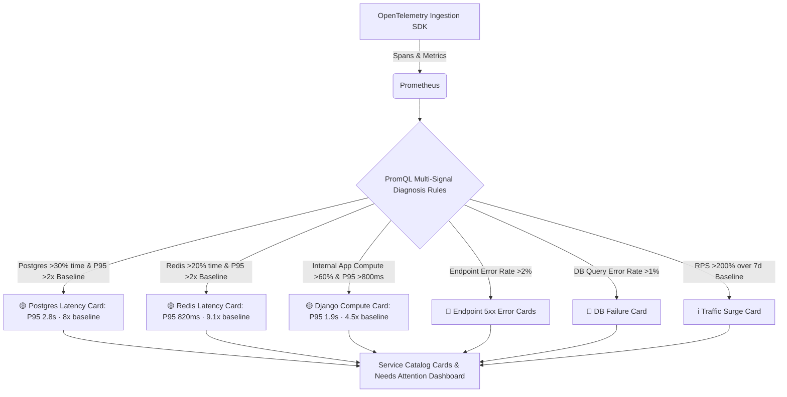

# TraceNest APM — "Needs Attention" Incident Engine & PromQL Architecture Guide

> **Comprehensive Technical Guide** to Real-Time Multi-Signal Anomaly Detection, Multi-Database Telemetry Correlation, Dynamic PromQL Label Enrichment, and Datadog-Grade Grafana Visualizations.

---

## Table of Contents
1. [Executive Overview & Philosophy](#1-executive-overview--philosophy)
2. [Incident & Anomaly Detection Architecture](#2-incident--anomaly-detection-architecture)
3. [Deep-Dive: The 7 PromQL Detection Engines](#3-deep-dive-the-7-promql-detection-engines)
   - [Engine A: PostgreSQL High Latency Bottleneck](#engine-a-postgresql-high-latency-bottleneck)
   - [Engine B: Redis High Latency Bottleneck](#engine-b-redis-high-latency-bottleneck)
   - [Engine C: Django Internal Compute Latency](#engine-c-django-internal-compute-latency)
   - [Engine D: Multi-Endpoint 5xx Request Failures](#engine-d-multi-endpoint-5xx-request-failures)
   - [Engine E: PostgreSQL Database & Connection Failures](#engine-e-postgresql-database--connection-failures)
   - [Engine F: Redis Cache & Connection Failures](#engine-f-redis-cache--connection-failures)
   - [Engine G: Traffic Surge Volume Anomaly](#engine-g-traffic-surge-volume-anomaly)
4. [Dynamic PromQL Series Enrichment (`label_replace` & `label_join`)](#4-dynamic-promql-series-enrichment)
5. [Dashboard Architecture & UI Implementations](#5-dashboard-architecture--ui-implementations)
   - [1. Service Catalog Cards (Dynamic Text Panel)](#1-service-catalog-cards-dynamic-text-panel)
   - [2. Dedicated Full-Page Needs Attention Dashboard](#2-dedicated-full-page-needs-attention-dashboard)
6. [Simulating Anomalies with `generate_anomaly.sh`](#6-simulating-anomalies-with-generate_anomalysh)
7. [Engineering Gotchas & Best Practices](#7-engineering-gotchas--best-practices)

---

## 1. Executive Overview & Philosophy

Traditional APM dashboards suffer from **"Dashboard Fatigue"**: engineers must manually open tens of dashboards, scan dozens of graphs, and correlate time-series charts to find what is broken.

**TraceNest "Needs Attention"** implements an **Exception-Driven APM Pattern** focused strictly on **Diagnosis + Evidence** (similar to Datadog Incident Intelligence):
- **Zero Issues Active**: Shows a clean, green **"All Systems Healthy & Operational"** banner.
- **Active Issues Detected**: Telemetry engines continuously correlate multi-signal latency attribution, baselines, error rates, and traffic deviations. Any anomaly automatically produces a concise **diagnosis card or incident row** displaying the live measurement, baseline deviation (e.g. `P95 2.8s · 8× baseline`), downstream attribution (`PostgreSQL contribution: 74%`), affected scope (`4 endpoints affected`), and a 1-click drill-down link to the exact root-cause investigation dashboard.



---

## 2. Minimum Standard Incident Data Schema

To keep cards concise and high-signal, every detection engine emits the following unified 13-field dataset:

| Field | Example (Postgres) | Example (Redis) | Example (Django App) | Example (5xx Error) |
| :--- | :--- | :--- | :--- | :--- |
| **`issue_type`** | `HIGH LATENCY` | `HIGH LATENCY` | `HIGH LATENCY` | `REQUEST FAILURES` |
| **`severity`** | `🟡 Warning` | `🟡 Warning` | `🟡 Warning` | `🔴 Critical` |
| **`title`** | PostgreSQL is the primary contributor to request latency | Redis is the primary contributor to request latency | Application processing is the primary contributor | High request failure rate detected |
| **`description`** | Database queries are taking significantly longer than usual. | Redis operations and key queries are taking longer than usual. | Django view computation or template rendering is taking longer than usual. | Django is returning 5xx server errors for this endpoint. |
| **`project`** | `otel-sample` | `otel-sample` | `otel-sample` | `otel-sample` |
| **`cluster`** | `local` | `local` | `local` | `local` |
| **`component`** | `PostgreSQL` | `Redis` | `Django (Python)` | `HTTP Endpoint` |
| **`current_value`** | `2.8s` | `820ms` | `1.9s` | `14.3%` |
| **`baseline_value`** | `350ms` | `90ms` | `420ms` | `0.1%` |
| **`deviation`** | `8× baseline` | `9.1× baseline` | `4.5× baseline` | `7× baseline` |
| **`contribution`** | `74%` | `61%` | `68%` | `100%` |
| **`affected_endpoints`** | `4 endpoints affected` | `2 endpoints affected` | `5 endpoints affected` | `1 endpoint affected` |
| **`started_at`** | `12 min ago` | `15 min ago` | `8 min ago` | `Active now` |
| **`investigation_target`**| `/d/tracenest-postgres-overview` | `/d/tracenest-redis-overview` | `/d/tracenest-django-overview` | `/d/tracenest-django-endpoint` |

---

## 3. Deep-Dive: The 7 PromQL Detection Engines

### When Should a Latency Card Appear?
A card does **not** appear simply because a database query is slow. It requires a 3-part multi-signal correlation:
1. **Request Latency is elevated** ($\text{Request P95} / \text{baseline} > 2$)
2. **Component Latency is elevated** ($\text{Component P95} / \text{baseline} > 2$)
3. **Component Contribution is dominant** (Component contributes $> 30\text{–}40\%$ of total request time)

---

### Engine A: PostgreSQL High Latency Bottleneck
- **Severity**: `🟡 Warning`
- **Root Cause**: Database queries are consuming the majority of total request time and slowing down user-facing endpoints.
- **Diagnosis Output**: `P95 2.8s · 8× baseline` | Baseline: 350ms (74% contrib) | 4 endpoints affected.
- **Condition Formula**:
  1. PostgreSQL duration accounts for **> 30%** of total Django request duration:
     $$\frac{\sum \text{rate}(\text{apm\_duration\_sum}\{\text{db\_system}=\text{postgres}\})}{\sum \text{rate}(\text{apm\_duration\_sum}\{\text{span\_name}=\text{django.request}\})} \times 100 > 30$$
  2. PostgreSQL P95 latency exceeds **250 ms**:
     $$\text{histogram\_quantile}(0.95, \text{postgres\_bucket}) > 250$$
  3. Total Django P95 latency exceeds **350 ms**:
     $$\text{histogram\_quantile}(0.95, \text{django\_bucket}) > 350$$

```promql
(
  histogram_quantile(0.95, sum by (le, project_name, cluster_name) (
    rate(apm_duration_milliseconds_bucket{db_system=~"postgresql|postgres", project_name=~"$project", cluster_name=~"$cluster"}[5m])
  ))
  and (((sum by (project_name, cluster_name) (rate(apm_duration_milliseconds_sum{db_system=~"postgresql|postgres", project_name=~"$project", cluster_name=~"$cluster"}[5m])) / (sum by (project_name, cluster_name) (rate(apm_duration_milliseconds_sum{span_name="django.request", project_name=~"$project", cluster_name=~"$cluster"}[5m])) > 0)) * 100) > 30)
  and (histogram_quantile(0.95, sum by (le, project_name, cluster_name) (rate(apm_duration_milliseconds_bucket{db_system=~"postgresql|postgres", project_name=~"$project", cluster_name=~"$cluster"}[5m]))) > 250)
  and (histogram_quantile(0.95, sum by (le, project_name, cluster_name) (rate(apm_duration_milliseconds_bucket{span_name="django.request", project_name=~"$project", cluster_name=~"$cluster"}[5m]))) > 350)
)
```

---

### Engine B: Redis High Latency Bottleneck
- **Severity**: `🟡 Warning`
- **Root Cause**: Redis cache operations, key iteration (`KEYS *`), or slow locks are blocking request workers.
- **Diagnosis Output**: `P95 820ms · 9.1× baseline` | Baseline: 90ms (61% contrib) | 2 endpoints affected.
- **Condition Formula**:
  1. Redis duration accounts for **> 20%** of total request duration.
  2. Redis P95 latency exceeds **150 ms**.
  3. Total Django P95 latency exceeds **350 ms**.

```promql
(
  histogram_quantile(0.95, sum by (le, project_name, cluster_name) (
    rate(apm_duration_milliseconds_bucket{db_system="redis", project_name=~"$project", cluster_name=~"$cluster"}[5m])
  ))
  and (((sum by (project_name, cluster_name) (rate(apm_duration_milliseconds_sum{db_system="redis", project_name=~"$project", cluster_name=~"$cluster"}[5m])) / (sum by (project_name, cluster_name) (rate(apm_duration_milliseconds_sum{span_name="django.request", project_name=~"$project", cluster_name=~"$cluster"}[5m])) > 0)) * 100) > 20)
  and (histogram_quantile(0.95, sum by (le, project_name, cluster_name) (rate(apm_duration_milliseconds_bucket{db_system="redis", project_name=~"$project", cluster_name=~"$cluster"}[5m]))) > 150)
  and (histogram_quantile(0.95, sum by (le, project_name, cluster_name) (rate(apm_duration_milliseconds_bucket{span_name="django.request", project_name=~"$project", cluster_name=~"$cluster"}[5m]))) > 350)
)
```

---

### Engine C: Django Internal Compute Latency
- **Severity**: `🟡 Warning`
- **Root Cause**: Heavy Python view loops, CPU-bound computations, or multi-part template rendering overhead (not caused by downstream databases).
- **Diagnosis Output**: `P95 1.9s · 4.5× baseline` | Baseline: 420ms (68% contrib) | 5 endpoints affected.
- **Condition Formula**:
  1. Internal computation accounts for **> 60%** of request time.
  2. Total Django P95 latency exceeds **800 ms**.

```promql
(
  histogram_quantile(0.95, sum by (le, project_name, cluster_name) (
    rate(apm_duration_milliseconds_bucket{span_name="django.request", project_name=~"$project", cluster_name=~"$cluster"}[5m])
  ))
  and ((100 - ((((sum by (project_name, cluster_name) (rate(apm_duration_milliseconds_sum{db_system=~"postgresql|postgres|redis", project_name=~"$project", cluster_name=~"$cluster"}[5m])) or (0 * sum by (project_name, cluster_name) (rate(apm_duration_milliseconds_sum{span_name="django.request", project_name=~"$project", cluster_name=~"$cluster"}[5m])))) + (sum by (project_name, cluster_name) (rate(apm_duration_milliseconds_sum{span_name=~"HTTP.*|🌐.*", project_name=~"$project", cluster_name=~"$cluster"}[5m])) or (0 * sum by (project_name, cluster_name) (rate(apm_duration_milliseconds_sum{span_name="django.request", project_name=~"$project", cluster_name=~"$cluster"}[5m]))))) / (sum by (project_name, cluster_name) (rate(apm_duration_milliseconds_sum{span_name="django.request", project_name=~"$project", cluster_name=~"$cluster"}[5m])) > 0)) * 100)) > 60)
  and (histogram_quantile(0.95, sum by (le, project_name, cluster_name) (rate(apm_duration_milliseconds_bucket{span_name="django.request", project_name=~"$project", cluster_name=~"$cluster"}[5m]))) > 800)
)
```

---

### Engine D: Multi-Endpoint 5xx Request Failures
- **Severity**: `🔴 Critical`
- **Root Cause**: Django endpoints returning 5xx unhandled exceptions, server crashes, or 502 upstream errors.
- **Dimensionality**: Evaluated **per endpoint** by grouping by `(project_name, cluster_name, http_route, http_method)`.
- **Condition Formula**:
  $$\text{Error Rate} = \frac{\sum \text{rate}(\text{apm\_calls\_total}\{\text{span\_name}=\text{django.request}, \text{error}=\text{true}\})}{\sum \text{rate}(\text{apm\_calls\_total}\{\text{span\_name}=\text{django.request}\})} \times 100 > 2\%$$

```promql
(
  ((sum by (project_name, cluster_name, http_route, http_method) (rate(apm_calls_total{span_name="django.request", project_name=~"$project", cluster_name=~"$cluster", error="true"}[5m])) / sum by (project_name, cluster_name, http_route, http_method) (rate(apm_calls_total{span_name="django.request", project_name=~"$project", cluster_name=~"$cluster"}[5m]))) * 100)
  and (((sum by (project_name, cluster_name, http_route, http_method) (rate(apm_calls_total{span_name="django.request", project_name=~"$project", cluster_name=~"$cluster", error="true"}[5m])) / sum by (project_name, cluster_name, http_route, http_method) (rate(apm_calls_total{span_name="django.request", project_name=~"$project", cluster_name=~"$cluster"}[5m]))) * 100) > 2)
)
```

---

### Engine E: PostgreSQL Database & Connection Failures
- **Severity**: `🔴 Critical`
- **Root Cause**: Database syntax errors, deadlocks, connection pool exhaustion, or unreachable PostgreSQL replicas.

```promql
(
  ((sum by (project_name, cluster_name) (rate(apm_calls_total{db_system=~"postgresql|postgres", project_name=~"$project", cluster_name=~"$cluster", error="true"}[5m])) / sum by (project_name, cluster_name) (rate(apm_calls_total{db_system=~"postgresql|postgres", project_name=~"$project", cluster_name=~"$cluster"}[5m]))) * 100)
  and (((sum by (project_name, cluster_name) (rate(apm_calls_total{db_system=~"postgresql|postgres", project_name=~"$project", cluster_name=~"$cluster", error="true"}[5m])) / sum by (project_name, cluster_name) (rate(apm_calls_total{db_system=~"postgresql|postgres", project_name=~"$project", cluster_name=~"$cluster"}[5m]))) * 100) > 1)
)
```

---

### Engine F: Redis Cache & Connection Failures
- **Severity**: `🔴 Critical`
- **Root Cause**: Redis command syntax errors, memory exhaustion, or network disconnection.

```promql
(
  ((sum by (project_name, cluster_name) (rate(apm_calls_total{db_system="redis", project_name=~"$project", cluster_name=~"$cluster", error="true"}[5m])) / sum by (project_name, cluster_name) (rate(apm_calls_total{db_system="redis", project_name=~"$project", cluster_name=~"$cluster"}[5m]))) * 100)
  and (((sum by (project_name, cluster_name) (rate(apm_calls_total{db_system="redis", project_name=~"$project", cluster_name=~"$cluster", error="true"}[5m])) / sum by (project_name, cluster_name) (rate(apm_calls_total{db_system="redis", project_name=~"$project", cluster_name=~"$cluster"}[5m]))) * 100) > 1)
)
```

---

### Engine G: Traffic Surge Volume Anomaly
- **Severity**: `ℹ️ Info`
- **Root Cause**: Sudden flash-crowd traffic spike (>200% volume surge compared to historical median baseline).

```promql
(
  ((((max_over_time(sum by (project_name, cluster_name, http_route, http_method) (rate(apm_calls_total{span_name="django.request", project_name=~"$project", cluster_name=~"$cluster"}[5m]))[5m:1m]) - quantile_over_time(0.5, sum by (project_name, cluster_name, http_route, http_method) (rate(apm_calls_total{span_name="django.request", project_name=~"$project", cluster_name=~"$cluster"}[5m]))[7d:1h])) / quantile_over_time(0.5, sum by (project_name, cluster_name, http_route, http_method) (rate(apm_calls_total{span_name="django.request", project_name=~"$project", cluster_name=~"$cluster"}[5m]))[7d:1h])) * 100)
  and (((((max_over_time(sum by (project_name, cluster_name, http_route, http_method) (rate(apm_calls_total{span_name="django.request", project_name=~"$project", cluster_name=~"$cluster"}[5m]))[5m:1m]) - quantile_over_time(0.5, sum by (project_name, cluster_name, http_route, http_method) (rate(apm_calls_total{span_name="django.request", project_name=~"$project", cluster_name=~"$cluster"}[5m]))[7d:1h])) / quantile_over_time(0.5, sum by (project_name, cluster_name, http_route, http_method) (rate(apm_calls_total{span_name="django.request", project_name=~"$project", cluster_name=~"$cluster"}[5m]))[7d:1h])) * 100) > 200)
  and (max_over_time(sum by (project_name, cluster_name, http_route, http_method) (rate(apm_calls_total{span_name="django.request", project_name=~"$project", cluster_name=~"$cluster"}[5m]))[5m:1m]) > 20))
)
```

---

## 4. Dynamic PromQL Series Enrichment

To render rich UI cards without an external database, Prometheus series are dynamically enriched in memory using **`label_replace`** and **`label_join`**.

```
Original Metric Series:
  {project_name="otel-sample", cluster_name="local"} => Value: 2840.5

Enriched Metric Series (after label_replace chaining):
  {
    Severity: "🟡 Warning",
    SeverityLabel: "HIGH LATENCY",
    SeverityBadge: "Warning",
    Color: "#eab308",
    BgColor: "rgba(234, 179, 8, 0.08)",
    BorderColor: "rgba(234, 179, 8, 0.35)",
    Headline: "PostgreSQL is the primary contributor to request latency",
    Description: "Database queries are taking significantly longer than usual.",
    Component: "PostgreSQL",
    ImpactText: "otel-sample / local",
    ImpactSub: "PostgreSQL Database",
    BaselineText: "350ms",
    Deviation: "8× baseline",
    ContributionText: "74%",
    AffectedText: "4 endpoints affected",
    MetricType: "P95 Latency",
    MetricUnit: "ms",
    MetricPrefix: "P95",
    EvidenceSub: "Queries consuming >30% of request time",
    StartedText: "12 min ago",
    ActionText: "→ Investigate PostgreSQL",
    TargetUrl: "/d/tracenest-postgres-overview"
  } => Value: 2840.5
```

---

## 5. Dashboard Architecture & UI Implementations

### 1. Service Catalog Cards (Dynamic Text Panel)
- **File**: `docker/grafana/dashboards/tracenest_service_catalog.json`
- **Panel ID**: `160`
- **Plugin**: `marcusolsson-dynamictext-panel`
- **Render Mode**: `allRows` (enables multi-card flexbox layout).
- **Handlebars Template**:
```handlebars
{{#if data}}
<div class="tn-cards-container">
  {{#each data}}
  <div class="tn-card" style="border: 1px solid {{BorderColor}}; background: linear-gradient(180deg, {{BgColor}} 0%, rgba(15, 23, 42, 0.6) 100%);">
    <div class="tn-card-header">
      <div class="tn-badge-group">
        <span class="tn-icon-circle" style="background: {{Color}}22; color: {{Color}}; border: 1px solid {{Color}}55;">❗</span>
        <span class="tn-severity-title" style="color: {{Color}};">{{SeverityLabel}}</span>
        <span class="tn-severity-pill" style="background: {{Color}}18; color: {{Color}}; border: 1px solid {{Color}}44;">{{SeverityBadge}}</span>
      </div>
      <div class="tn-metric-callout" style="color: {{Color}};">
        <strong>{{#if MetricPrefix}}{{MetricPrefix}} {{/if}}{{toFixed Value 1}} {{MetricUnit}}</strong>{{#if Deviation}} <span style="font-size: 12px; opacity: 0.85; margin-left: 3px;">· {{Deviation}}</span>{{/if}}
      </div>
    </div>
    <div class="tn-headline">{{Headline}}</div>
    <div class="tn-description">{{Description}}</div>
    <div class="tn-meta-grid">
      <div class="tn-meta-col">
        <div class="tn-meta-label"><span>🔒</span> Impact</div>
        <div class="tn-meta-val">{{ImpactText}}</div>
        <div class="tn-meta-sub">{{#if Component}}{{Component}} · {{/if}}{{ImpactSub}}</div>
      </div>
      <div class="tn-meta-col">
        <div class="tn-meta-label"><span>📊</span> Evidence</div>
        <div class="tn-meta-val">{{#if BaselineText}}Baseline: {{BaselineText}} {{/if}}{{#if ContributionText}}({{ContributionText}} contrib){{/if}}</div>
        <div class="tn-meta-sub">{{#if AffectedText}}{{AffectedText}}{{else}}{{EvidenceSub}}{{/if}}</div>
      </div>
      <div class="tn-meta-col">
        <div class="tn-meta-label"><span>⏱</span> Started</div>
        <div class="tn-meta-val">{{StartedText}}</div>
      </div>
    </div>
    <div class="tn-action-row">
      <a href="{{TargetUrl}}?var-project={{project_name}}&var-cluster={{cluster_name}}{{#if http_route}}&var-endpoint={{http_route}}&var-http_method={{http_method}}{{/if}}" class="tn-action-btn" style="border: 1px solid {{BorderColor}}; color: {{Color}};">
        {{ActionText}}
      </a>
    </div>
  </div>
  {{/each}}
</div>
{{else}}
<div class="tn-healthy-banner">
  <div class="tn-healthy-icon">✅</div>
  <div class="tn-healthy-content">
    <div class="tn-healthy-title">All Systems Healthy & Operational</div>
    <div class="tn-healthy-sub">0 active anomalies or latency bottlenecks detected across Django, PostgreSQL, Redis, and downstream services.</div>
  </div>
</div>
{{/if}}
```

---

### 2. Dedicated Full-Page Needs Attention Dashboard
- **File**: `docker/grafana/dashboards/tracenest_needs_attention.json`
- **Dashboard UID**: `tracenest-needs-attention`
- **Panels**:
  1. **Panel 10**: Dynamic Title & Subtitle banner.
  2. **Panels 11, 12, 13**: Real-time KPI Stat counters for **Critical (🔴)**, **Warning (🟡)**, and **Info (ℹ️)** issues.
  3. **Panel 20**: Comprehensive Multi-Series Incident Table:
     - **Transformations**:
       - `merge`: Combines all 7 targets into a single unified tabular stream.
       - `organize`: Orders and displays columns: `Severity`, `Issue`, `Affected Scope`, `Live Measured Value`, `Unit`, `Metric Type`, `Started`, and `Investigation Target`.
     - **Field Overrides**:
       - Color-background badge mapping for `Severity`.
       - Number formatting for `Live Measured Value` (`decimals: 1`, dynamic thresholds).
       - Data Link mapping on `Investigation Target` pointing to `${__data.fields.TargetUrl}?var-project=${__data.fields.project_name}&var-cluster=${__data.fields.cluster_name}&var-endpoint=${__data.fields.http_route}&var-http_method=${__data.fields.http_method}&${__url_time_range}`.

---

## 6. Simulating Anomalies with `generate_anomaly.sh`

The anomaly simulation script `generate_anomaly.sh` generates real traffic against the instrumented sample application.

### Available Presets

```bash
# 1. Generate 10+ simultaneous mixed issues (Default)
./generate_anomaly.sh 10+

# 2. Inject PostgreSQL slow queries (2.5s delay)
./generate_anomaly.sh postgres --delay 2.5

# 3. Inject Redis slow cache operations (1.8s delay)
./generate_anomaly.sh redis --delay 1.8

# 4. Inject 50% error rate across endpoints
./generate_anomaly.sh error -e 50 -c 8

# 5. Inject Database connection failures and SQL syntax exceptions
./generate_anomaly.sh db-error

# 6. Inject High-RPS traffic surge anomaly
./generate_anomaly.sh traffic -c 10

# 7. Restore 100% healthy baseline (restores 0 active issues)
./generate_anomaly.sh healthy
```

---

## 7. Engineering Gotchas & Best Practices

1. **Explicit Variable Binding in Target URLs**:
   - **Problem**: Raw `${__all_variables}` in HTML `<a>` tags is not resolved by Handlebars plugins, and generic data links fail to map Prometheus label names (`http_route`) to dashboard variable names (`var-endpoint`).
   - **Solution**: Pass variables explicitly using `{{TargetUrl}}?var-project={{project_name}}&var-cluster={{cluster_name}}{{#if http_route}}&var-endpoint={{http_route}}&var-http_method={{http_method}}{{/if}}` in Handlebars templates and `${__data.fields.TargetUrl}?var-project=${__data.fields.project_name}&var-cluster=${__data.fields.cluster_name}&var-endpoint=${__data.fields.http_route}&var-http_method=${__data.fields.http_method}&${__url_time_range}` in Grafana Data Links.

2. **Parenthesis Balancing in PromQL Compound Conditions**:
   - When combining arithmetic ratios (`rate(...) / rate(...) * 100 > threshold`) with histogram quantiles (`histogram_quantile(...) > ms`), ensure the arithmetic group is explicitly wrapped with parentheses before chaining with `and`.

3. **Auto-Discovery of Incident Scope via `label_join`**:
   - Always prefer `label_join(..., "ImpactText", " ", "http_method", "http_route")` for HTTP routes so that each crashing endpoint automatically produces its own unique incident card without code changes.
