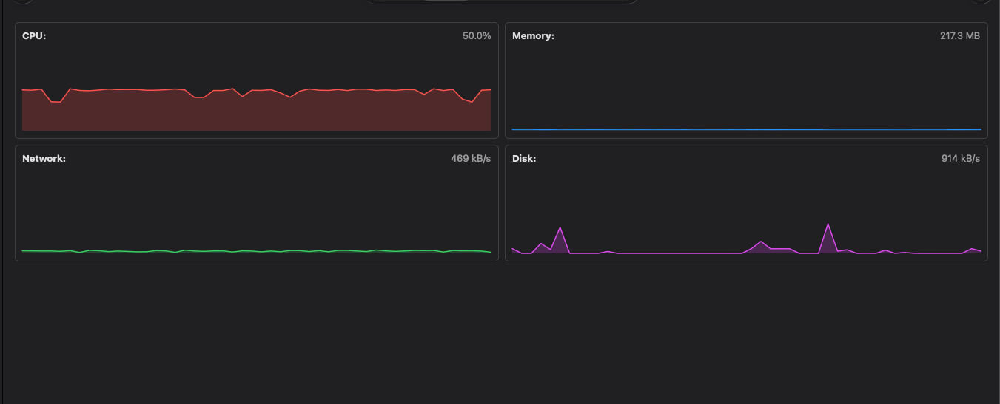

# Resource Usage & Load Test

This document tracks the resource consumption of the OpenTelemetry Collector container (`tp-otel-collector`) during load testing.

---

## Test Setup

The collector container was configured with the following limits in `docker-compose.yml`:
* **CPU Limit**: `0.5` Core (50%)
* **Memory Limit**: `256 MB`

A continuous load test was run against the application to generate traces, database queries, and metrics.

---

## Test Results

| Metric | Configured Limit | Measured Usage | Status |
| :--- | :--- | :--- | :--- |
| **CPU** | 0.5 Core (50%) | **40% – 50%** | Stable under load |
| **Memory** | 256 MB | **~217 MB – 225 MB** | Flat line (no memory leaks) |
| **Network** | - | **~469 kB/s** | Continuous trace ingestion/export |
| **Disk** | - | **~914 kB/s** | Minimal / transient writes |

---

## Metrics Graph

---

## Key Takeaways

1. **Stable CPU**: Uses around 40–50% of the allocated 0.5 CPU limit during active traffic without throttling.
2. **Safe Memory Margin**: Memory stays steady around 217–225 MB and does not exceed the 256 MB limit or trigger OOM kills.
3. **Recommended Minimum**: `0.5 vCPU` and `256 MB RAM` is sufficient for standard workloads.